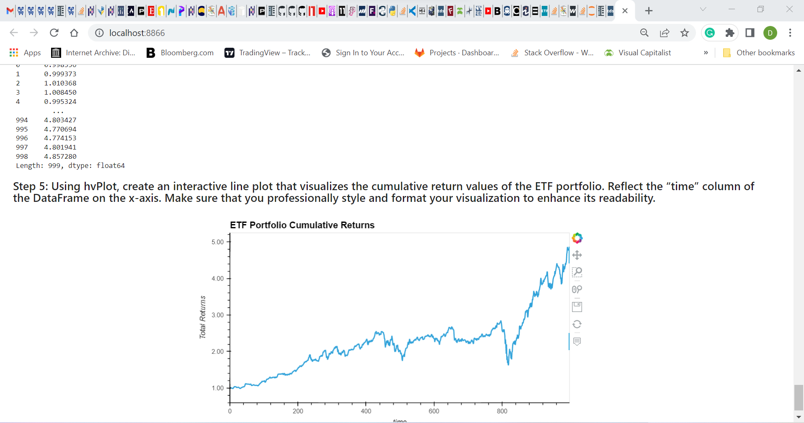
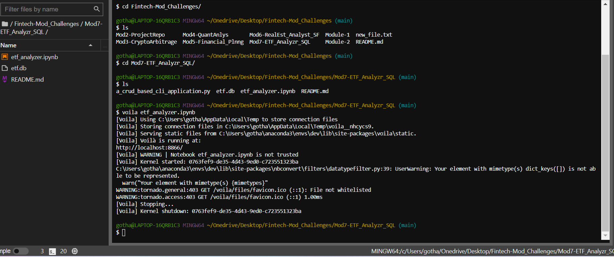

# FinTech ETF Analysis Using Financial Database and Webapp

*'Welcome to my FinTech project as an 'ETF Analyst to analyze the performance of an ETF portfolio'*

---

## Background
This project constructs a program for analysts to research ETF's and ETF portfolios for investors. The increasing interest in passive investing made ETFs (exchange traded funds) popular for portfolios because they offer greater diversification by asset class than by selecting individual stocks. Individual securities of equities and fixed-income instruments require more active research time and greater risk individually than an ETF. It is a packaged portfolio of securities by asset class, index or theme. As such, ETFs offer more diversity as a package of securitized assets to build a portfolio. 

The FinTech app technology in this program is utilized to analyze the performance of an ETF and an ETF portfolio. It proceeds through several steps to achieve its purpose by building a database using SQL; analyze individual ETF performance and as a group; optimize data access with SQL queries; build and evaluate an ETF portfolio; and deploy 'Voilà' as an interactive web application from Jupyter notebook. 

To facilitate communication between Python-based programs and databases SQLAlchemy was designed as an open-source library for the Python database toolskit. By deploying 'Voilà' from the python library, the user and client can visualize the data through plot charts to aid research and make determinations. Utilizing this program can efficiently expedite investment decisions for selecting ETFs and asset class performance in an ETF portfolio.      

This program gives users a step-by-step process to customize aggregation, utilize numerical data into visual plot charts for analyzing performance and allow clients to see it with convincing interactive visualizations for making investment decisions.


---

## Technologies

The software operates on python 3.9 with the installation package imports embedded with Anaconda3 installation. the tools that you need for this module, which include SQLAlchemy and Voilà. It includes 'PyViz' as a single platform for accessing multiple visualization libraries from the Python visualization package. Two PyViz libraries, hvPlot and bokeh are utilized for charting in this program. 

* [anaconda3](https://docs.anaconda.com/anaconda/install/windows/e) . 

* [SQLAlchemy](https://www.sqlalchemy.org/) .

* [Voilà](https://voila.readthedocs.io/en/stable/index.html)

* [pyviz hvplot](https://hvplot.holoviz.org/index.html#) .

---

## Installation Guide

Before running the applications first activate the Conda development environment and launch JupyterLab to import the following required libraries apps. If hvplot and bokeh.models are not installed with anaconda, the recommended way to install hvPlot and bokeh for the interactive HooverTools is using the conda terminal command below provided by Anaconda. For SQLAlchemy, first confirm it is installed in the conda environment through the terminal by following the procedure below. To install Voilà, open a terminal window, and then complete the following steps below.

```python libraries
import pandas as pd
import numpy as np
import hvplot.pandas
import sqlalchemy
from bokeh.models import HoverTool
from pathlib import Path 

'non-virtual environ use' [pip3 install jupyter] or 'virtual environ use' [conda install -m pip install bokeh] 

1) Activate the Conda dev environment. 2) Run the following command: [conda list sqlalchemy] 

1) Activate your Conda 'dev' environment. 2) Run the following command: [conda install -c conda-forge voila]; 3) Confirm the installation succeeded by running the command: [conda list voila]

```

---
# Usage

This application is launched from web-based JupyterLab utilizing Pandas which is designed for data analysis to write and read code in an IDE and review results through the Python libraries. The Anaconda3 software application includes the Pandas libraries; **'PyViz' as a single platform for accessing PyViz libraries, including hvPlot.** They are utilized for high-level plot charts in this program from the Python visualization package. **HoverTool**is imported from the Bokeh library for **hvplot**. It utilizes data frames and plot charts in an integrated Conda development environment. 

The program is developed in Jupyter notebooks on a **.ipny** file. These apps makes it much easier to explore data in interactive plot properties, without having to write additional code to select ranges, columns, or data values manually. These interactive visualization libraries also improve browser plot presentations. Together they advance functions to create informative visualizations from the Pandas DataFrames and data metrics. 

SQLAlchemy is a python toolkit that facilitates the handling of relational databases in SQL into python objects. It is passed through the database engine, so one can use python code to Create, Read, Update and Delete data. Combining SQL with python code is more efficient to query needed data with conditional language in SQL. SQL is a language that helps manage and analyze data that’s in databases. We can also use it with Python to build applications that interact with databases.    

Voilà allows the user to convert the Jupyter Notebook into an interactive web app to share the program with others. As Voilà runs the code in the Notebook its output is converted to HTML in a browser for an interactive visual experience. 

 



```python
etf_analyzer.ipynb
```
 

---

## Contributors

*Provided to you by digi-Borg FinTek*, 
Dana Hayes: nydane1@gmail.com

---

## License

Columbia U. Engineering